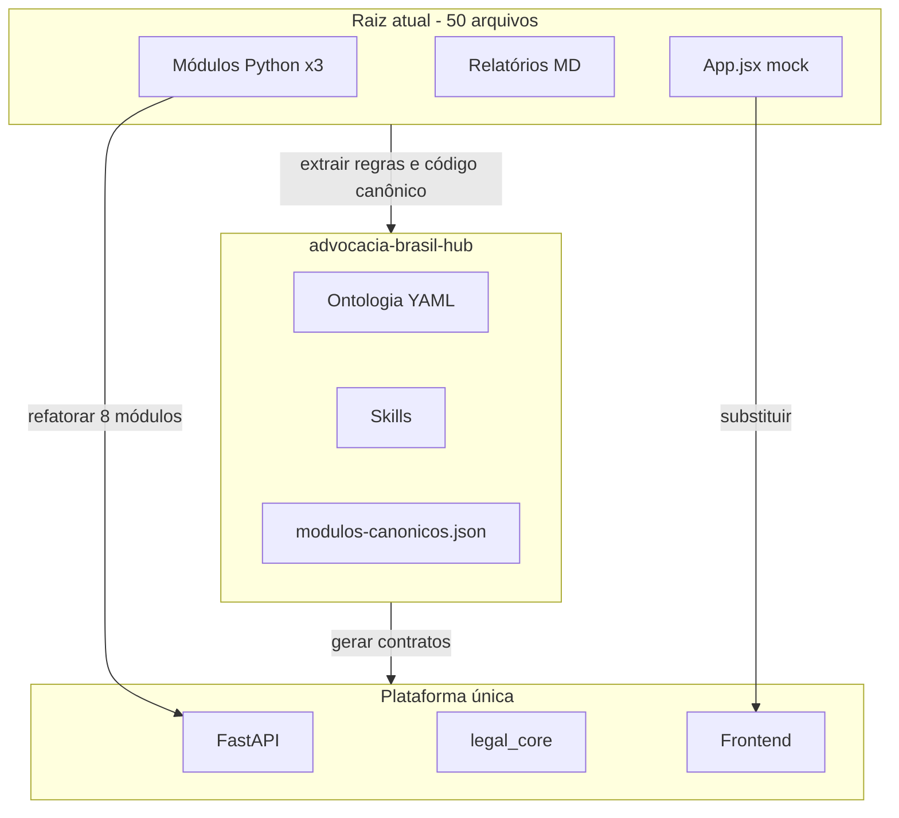

# Processo de harmonização — passo a passo

## Quatro camadas que devem dizer a mesma coisa

| Camada | O quê | Onde |
|--------|-------|------|
| Conhecimento | Tipos, prazos, requisitos CPC | `ontology/`, `docs/governanca-*` |
| Prompts | Como a IA executa cada capacidade | `prompts/`, `docs/fundamentos-prompt-101-juridico.md` |
| Agente | Como analisar/gerar/revisar no Cursor | `.cursor/skills/` |
| Software | Execução determinística + API | `services/`, `packages/legal_core/` |

Se uma camada mudar (ex.: novo tipo de peça), atualizar **as quatro** + `config/mapa-fundamentos-prompt.json`.

## Ritual de mudança (checklist)

1. Editar YAML em `ontology/`
2. Atualizar skill relacionada
3. Atualizar enum/validador em Python
4. Atualizar schema JSON se mudar contrato de API
5. Adicionar teste em `tests/` (caso de petição, prazo feriado, etc.)

## Conciliação dos arquivos Manus

## Prioridade de implementação

1. **Análise documental** + validação CPC (maior valor advocacia)
2. **Prazos** (determinístico, rápido)
3. **Calculadora** (sem LLM)
4. **Geração de peças** (com revisão humana)
5. **Pesquisa** (depende de APIs externas)
6. Workflows, analytics, assistente

## Participação humana

- Advogado valida toda peça antes de protocolo
- Calendário de tribunal confirmado para prazos críticos
- DPO do escritório aprova fluxo de dados (LGPD)
