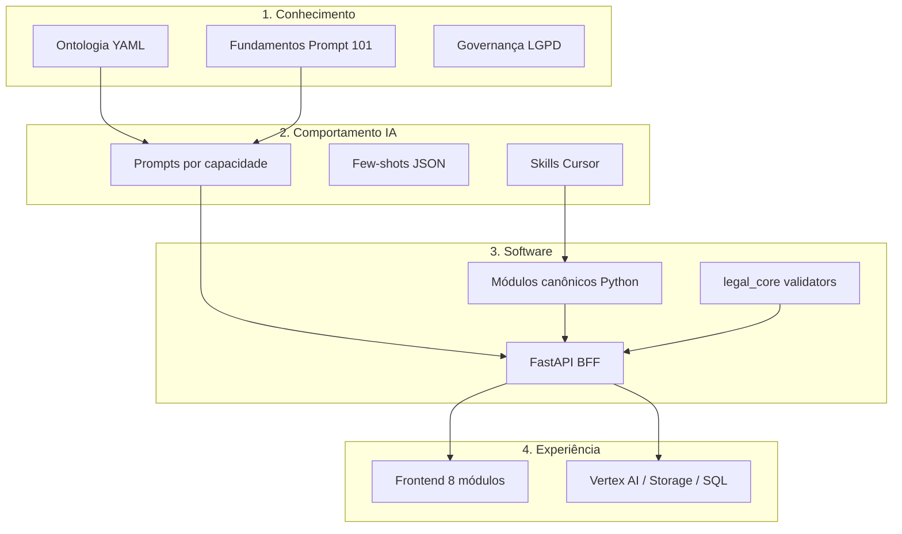

# Análise v2 — Solução full Advocacia Brasil (com Prompt 101)

**Data:** maio/2026  
**Base:** protótipo Manus + `advocacia-brasil-hub` + Fundamentos de Prompt 101

---

## 1. O que mudou nesta versão

Integração explícita dos **28 fundamentos de prompt** ao desenho do produto:

- **22 fundamentos** entram no runtime (com ajustes jurídicos).
- **2 excluídos** do produto (#6 gorjeta, #15 modo ensino).
- **1 só desenvolvimento** (#22 multi-arquivo → agentes Cursor).
- **3 reformulados** (#1 tom formal, #10 rejeição de schema, #11 PT jurídico).

Artefatos novos: `docs/fundamentos-prompt-101-juridico.md`, `config/mapa-fundamentos-prompt.json`, prompts por capacidade, template único, skill `prompt-engineering-juridico`.

---

## 2. Arquitetura da solução full (4 camadas)



---

## 3. Capacidades × prompts × código × fundamentos

| Capacidade | Prompt | Módulo Python | Fundamentos-chave | LLM? |
|------------|--------|---------------|-------------------|------|
| Análise documental | `sistema-analise-documento.md` | `enhanced_document_analyzer.py` | 3,7,12,13,16,18,19,27 | Sim |
| Validação CPC | `sistema-validacao-cpc.md` | extrair de `advanced_document_features.py` | 4,9,17,24 | Sim + regras |
| Geração de peça | `sistema-geracao-peca.md` | `enhanced_document_generator.py` | 14,20,23,25,28 | Sim |
| Fundamentação | `sistema-fundamentacao-juridica.md` | (mesmo serviço documents) | 12,13,16,24 | Sim |
| Pesquisa | `sistema-pesquisa-normativa.md` | `enhanced_intelligent_search.py` | 12,13,24 | Sim |
| Prazos | — (explicação opcional) | `deadline_manager.py` | 24 | Não |
| Calculadora | — | `enhanced_legal_calculator.py` | 24 | Não |
| Assistente | `sistema-assistente-escritorio.md` | `enhanced_virtual_assistant.py` | 2,5,14,16 | Sim |
| Workflows | triggers pós-análise | `enhanced_workflow_engine.py` | 3 | Parcial |
| Analytics | relatórios | `enhanced_analytics_engine.py` | 5,27 | Parcial |

---

## 4. Pipeline recomendado — análise documental → peça

Ordem inspirada em #3 (passos) e #18 (passo a passo + few-shot):

1. **Upload** → OCR/texto → delimitador `<<<DOCUMENTO>>>` (#16)
2. **Classificação rápida** (prompt curto #26) → tipo + área
3. **Análise completa** (`sistema-analise-documento.md` + few-shot) → JSON schema
4. **Validação CPC** se petição/recurso inicial → `compliance_score`
5. **Perguntas** ao advogado se `gaps` críticos (#14)
6. **Pesquisa** só com fontes indexadas (#24, anti-alucinação)
7. **Fundamentação** + **geração** (#20, #23, #25)
8. **Revisão humana** obrigatória → protocolo

Determinístico onde possível: prazos (#24 sem LLM), calculadora, checklist CPC parcial em `legal_core`.

---

## 5. Estado atual vs. alvo

| Dimensão | Hoje (pasta raiz) | Alvo v2 |
|----------|-------------------|---------|
| Prompts | Espalhados em `.py` (OpenAI inline) | Hub `prompts/` + Vertex |
| Conhecimento jurídico | Enums duplicados em 3 versões | Ontologia YAML única |
| Fundamentos Prompt 101 | Não formalizados | Mapa + template + skill |
| API | Inexistente | FastAPI + schemas |
| Frontend | Mock `App.jsx` | 8 módulos reais |
| Testes | 57% pass (Manus) | ≥85% fluxos críticos |
| Compliance | Disclaimer pontual | LGPD + OAB em todas as saídas |

---

## 6. Roadmap executivo (8 semanas indicativas)

| Semana | Entrega |
|--------|---------|
| 1 | Git + `legal_core` a partir de ontologia; API `analyze` + `deadlines` |
| 2 | Integrar prompts do hub no serviço documents (Vertex); few-shot em produção |
| 3 | Validador CPC em código + prompt; frontend upload → JSON |
| 4 | Geração de peça com cadeia fundamentação → minuta (#28) |
| 5 | Calculadora + pesquisa (mock → conector 1) |
| 6 | Workflows pós-análise; assistente com #14 |
| 7 | Multi-tenant, auditoria LGPD |
| 8 | Hardening, testes, piloto escritório |

---

## 7. Inventário do hub (pós-integração Prompt 101)

```
advocacia-brasil-hub/
├── assets/regras_de_prompt.png
├── config/
│   ├── modulos-canonicos.json
│   ├── matriz-capacidades.json
│   └── mapa-fundamentos-prompt.json    ← NOVO
├── docs/
│   ├── fundamentos-prompt-101-juridico.md  ← NOVO
│   ├── solucao-full-analise-v2.md          ← este arquivo
│   └── ...
├── prompts/
│   ├── _template-prompt-juridico.md    ← NOVO
│   ├── sistema-*.md (6 capacidades)    ← ampliado
│   └── exemplos/*.fewshot.json         ← NOVO
├── ontology/
├── schemas/
└── .cursor/skills/ (+ prompt-engineering-juridico)
```

---

## 8. Decisão de produto

A solução full não é “mais um chat jurídico”. É:

1. **Motor documental** (análise + CPC + geração com prompts padronizados).
2. **Motor determinístico** (prazos BR, cálculos).
3. **Camada de pesquisa** com fontes verificáveis.
4. **Governança** (LGPD, OAB, schemas, sem alucinação normativa).

Os Fundamentos de Prompt 101 **aceleram qualidade e consistência** da camada 1 e 3; as camadas 2 e validações CPC em código **reduzem risco** e custo de tokens.

---

## 9. Sprint 1 — concluído (maio/2026)

Implementado na raiz do projeto:

- `packages/legal_core/` — validador CPC, serializers, prompts, ontologia YAML
- `services/api/` — FastAPI com `/v1/documents/*`, `/v1/deadlines/calculate`, `/v1/calculator/run`
- `tests/test_smoke.py` — testes básicos
- `README.md`, `requirements.txt`, `scripts/run_api.ps1`

## 10. Próxima ação recomendada

**Concluído (sprint 2):**

- `apps/web/` — React/Vite com análise, validação CPC e prazos
- `packages/ai_provider/gemini.py` — enriquecimento opcional com prompts do hub
- API: `enhance_with_gemini`, `gemini_available` em `/v1/health`

**Concluído (sprint 3):**

- Aba **Calculadora** na UI (rescisão, danos morais, correção monetária)
- Módulos canônicos em `services/modules/` (bootstrap prioriza essa pasta)
- `tests/test_smoke.py` — 4 testes (inclui calculadora)

**Concluído (sprint 4):**

- `POST /v1/search/query` — pesquisa normativa (base simulada + síntese Gemini)
- `GET/POST /v1/generation/*` — templates e geração de peças (Jinja2 + Gemini opcional)
- UI: abas **Pesquisa** e **Peças**
- `tests/test_smoke.py` — 6 testes

**Pendente:**

1. Fontes jurídicas reais (DataJud, STJ, LexML)
2. Vertex AI com service account em produção
3. Workflows (`enhanced_workflow_engine`) e assistente na UI
